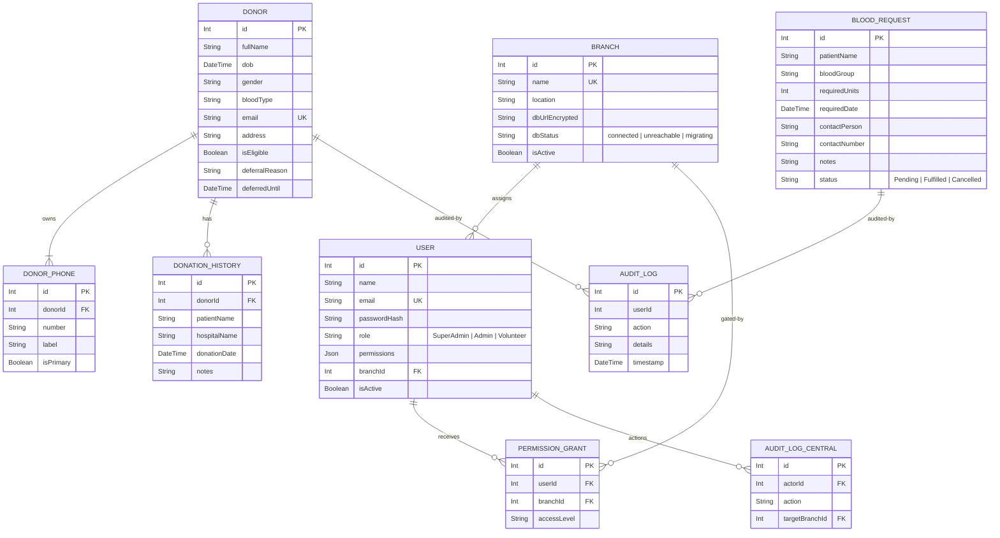

# Document Metadata: Scoping & Idea (idea.md)

*   **Purpose:** Establishes the high-level vision, target audience, core goals, database entity layout, and primary scope exclusions for the project.
*   **Information Contained:** System overview, target users, security/access scope, main business goals, simplified multi-branch database entity-relationship diagram (ERD), and out-of-scope boundaries.
*   **Recommended Headings:** `# Document Metadata`, `# Project Scoping & Idea`, `## 1. System Overview`, `## 2. Core Goals`, `## 3. Simplified Database Schema`, `## 4. Key Scope Exclusions`.
*   **Dependencies:** None (serves as the foundational concept document).

---

# Project Scoping & Idea - Internal Blood Management System

This document outlines the core architecture, scoping, and data model for the Internal Blood Management System, incorporating the **Multi-Branch Database Architecture (Update 1)**.

---

## 1. System Overview

The **Internal Blood Management System** is a secure web application designed exclusively for the organization's management team to manage blood donors, track donation history, and handle incoming blood requests across different branches.

### Target Audience & Access Control
*   **Internal Access Only:** Only authorized management, staff, and branch administrators can access the system.
*   **Database-per-Branch Isolation:** Each branch database is completely independent. Staff in one branch cannot view or modify donor data in another branch unless specifically granted cross-branch access permissions.
*   **No External Portals:** There are no public interfaces, donor login pages, or patient portal dashboards.
*   **Role-Based Security:** Privilege structure features three core levels:
    *   `SuperAdmin`: System-wide access, creates new branches, configures databases, decrypts connection strings.
    *   `Admin`: Manages user credentials, coordinates donor records, exports files, views branch audit logs.
    *   `Volunteer`: Searches donors, edits contact profiles, registers intake records, records donation history logs.

---

## 2. Core Goals

1.  **Isolated Branch Storage:** Each branch operates on its own dedicated PostgreSQL instance, avoiding shared database limits.
2.  **Central User Registry:** A single control database stores login credentials, permissions, and branch assignments.
3.  **Donor Intake & Status Verification:** Maintain comprehensive profiles within each branch database, verifying donor eligibility automatically.
4.  **Donation History Logging:** Track donation histories to calculate the mandatory 56-day wait period.
5.  **Blood Request Coordination:** Track patient needs (`Pending`, `Fulfilled`, `Cancelled`) at the branch level.
6.  **Secure Connection Management:** Encrypt branch database URLs at rest. Use a dynamic connection registry on the backend to swap databases on the fly.
7.  **Spreadsheet Imports/Exports:** Support bulk CSV/Excel donor registrations and filtered search list exports.
8.  **Audit Logs:** Track user operations locally (within the branch DB) and central administrator operations (within the control DB).

---

## 3. Simplified Database Schema

The architecture splits records between a single Central Control Database and multiple isolated Branch Databases.

---

## 4. Key Scope Exclusions

*   **No Physical Stock Tracking:** No tracking of actual physical blood bag volumes, labels, temperature monitors, or storage facilities.
*   **No Centralized Donor Pool Queries:** To maintain database-per-branch isolation, there are no cross-database query searches. A staff member searches only the database of the active branch they are logged into.
*   **No Automated External Notifications:** No automated emails or SMS alerts sent to donors. Communication is handled manually by phone.
