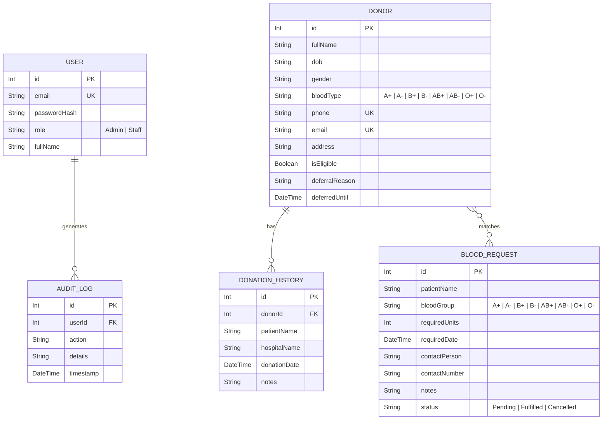

# Document Metadata: Scoping & Idea (idea.md)

*   **Purpose:** Establishes the high-level vision, target audience, core goals, database entity layout, and primary scope exclusions for the project.
*   **Information Contained:** System overview, target users, security/access scope, main business goals, simplified entity-relationship diagram (ERD), and out-of-scope boundaries.
*   **Recommended Headings:** `# Document Metadata`, `# Project Scoping & Idea`, `## 1. System Overview`, `## 2. Core Goals`, `## 3. Simplified Database Schema`, `## 4. Key Scope Exclusions`.
*   **Dependencies:** None (serves as the foundational concept document).

---

# Project Scoping & Idea - Internal Blood Management System

This document outlines the core architecture, scoping, and data model for the Internal Blood Management System.

---

## 1. System Overview

The **Internal Blood Management System** is a secure web application designed exclusively for the organization's management team to manage blood donors, track donation history, and handle incoming blood requests.

### Target Audience & Access Control
*   **Internal Access Only:** Only authorized management and administrative staff members can access and interact with the system.
*   **No External Portals:** There are no public portals, donor dashboards, patient log-ins, or hospital accounts. All requests and history logs are processed and entered manually by the internal team.
*   **Role-Based Security:** Strict division of privileges (e.g., standard Staff who input records vs. Admins who manage requests, view audit logs, and perform data import/export).

---

## 2. Core Goals

1.  **Centralized Donor Database:** Maintain comprehensive profiles of registered donors, including eligibility tracking.
2.  **Donation History Recording:** Log donation records against donor profiles to keep a complete chronological log.
3.  **Blood Request Management:** Log, search, and update patient-specific blood requests.
4.  **Advanced Search & Filtering:** Enable staff to quickly find eligible donors by blood type, location, and availability.
5.  **Excel/CSV Import & Export:** Bulk import donor lists from legacy spreadsheets and export query results or statistics for administrative reports.
6.  **Activity & Audit Trails:** Keep an immutable ledger of all database edits, data imports/exports, and state updates to ensure regulatory accountability.
7.  **Reports & Analytics:** Dashboard showing donor registration numbers, active requests, and donation frequency stats.

---

## 3. Simplified Database Schema

The database relies on five primary relational tables. Physical inventory tables (such as blood bags, storage locations, or disposal logs) are entirely excluded.

---

## 4. Key Scope Exclusions

To maintain an MVP focus, the following features are **explicitly out of scope**:
*   **No Physical Stock Tracking:** No tracking of blood bag storage, volume, locations, or status tags (Available, Expired, etc.).
*   **No Barcode Scanning:** No barcode, QR code, or Bag ID management.
*   **No Dispatch Workflows:** No FIFO bag allocation, dispatches, or distribution logs.
*   **No External Portals:** No self-service registration or login dashboards for hospitals, patients, or donors.
