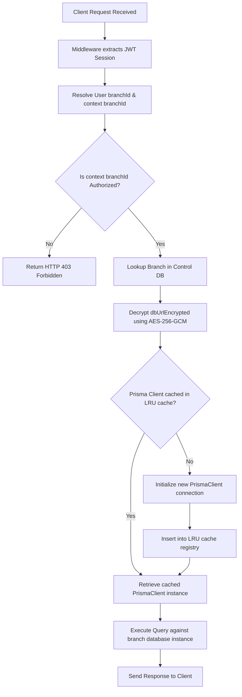
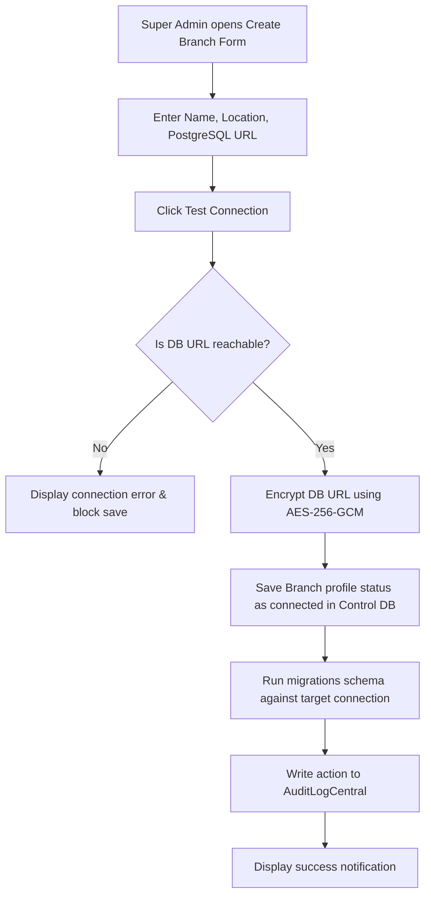

# Document Metadata: User Flows (user-flow.md)

*   **Purpose:** Maps visual and textual paths of core actions inside the web application for key workflows.
*   **Information Contained:** Mermaid diagrams, TanStack Query cache lifecycle states, client-side papaparse/xlsx verification hooks, and dynamic database connection resolution steps.
*   **Recommended Headings:** `# Document Metadata`, `# MVP User Flows`, `## 1. Dynamic Database Connection Resolution Flow`, `### Visual Flowchart`, `### Detailed Step Sequence`, `## 2. Branch Database Provisioning Flow`, `## 3. Donor Intake & Donation History Recording Flow`.
*   **Dependencies:** [user-story.md](file:///d:/blood%20donetion%20softwere/docs/user-story.md) (diagrams the operations described by user stories).

---

# MVP User Flows

This document details the step-by-step user interactions and system transitions for key operations in the Internal Blood Management System, incorporating the **Multi-Branch Database Architecture (Update 1)**.

---

## 1. Dynamic Database Connection Resolution Flow

This flow details how the system resolves the target PostgreSQL database connection for each request.

### Visual Flowchart

### Detailed Step Sequence

1.  **Request & Session Verification:**
    *   The client initiates a request (e.g. GET `/api/donors`).
    *   The server-side middleware decodes the session token (Auth.js) from encrypted cookies.
2.  **Context Mapping:**
    *   The system checks the user's default `branchId` and their target context branch ID (stored in the session/cookies).
    *   The system validates if the user has an active permission grant for the selected context. If not, it blocks execution with a `403 Forbidden` response.
3.  **Connection Lookup & Decryption:**
    *   The database manager fetches the branch record from the Control Database and decrypts `dbUrlEncrypted`.
4.  **LRU Cache Registry Retrieval:**
    *   The decrypted connection URL is checked against the active connections cache.
    *   If found, the existing client is reused. If not, a new `PrismaClient` is generated and added to the LRU pool (releasing the oldest client if capacity is exceeded).
5.  **Execution:**
    *   The request executes against the resolved branch database and returns the result.

---

## 2. Branch Database Provisioning Flow

Covers how a Super Admin creates a new branch and initializes its database.

### Visual Flowchart

---

## 3. Donor Intake & Donation History Recording Flow

This flow covers how staff registers a donor and logs history, isolated to their active branch database.

### Detailed Step Sequence

1.  **Look-up / Intake:**
    *   Staff enters search filters in the TanStack Table query input.
    *   The dynamic database registry resolves the active branch database connection and searches its local table.
    *   *If the donor is new*, the staff clicks "Register Donor", inputs contact details, blood type, and phone list (validated by Zod), and submits.
2.  **Eligibility Verification:**
    *   The system checks the donor's eligibility status within the branch database.
    *   If their last logged donation date was less than 56 days ago, their profile displays a "Deferred" status alert with the remaining days. The "Record Donation History" button is disabled.
3.  **Logging History:**
    *   If the donor is eligible, the staff clicks "Record Donation History".
    *   Staff enters: Patient Name, Hospital Name, Donation Date, and optional Notes.
4.  **Save & Status Sync:**
    *   Staff submits the form. The transaction updates the donor's `isEligible` flag to `false`, calculates the `deferredUntil` date (+56 days), appends the event, and writes an entry to the local `AuditLog` table.
    *   TanStack Query automatically invalidates the local query keys, refetching fresh details to display the updated "Deferred" status flag in the UI.
