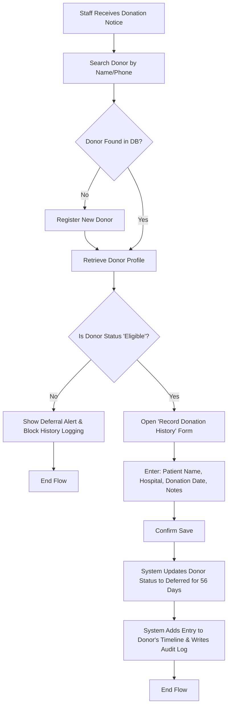
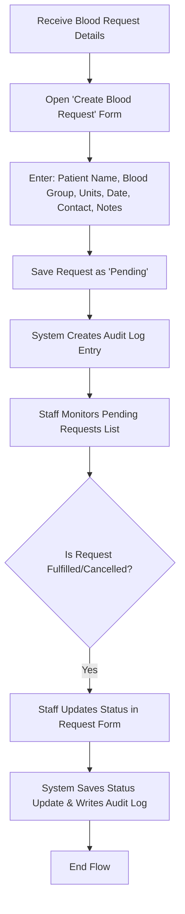
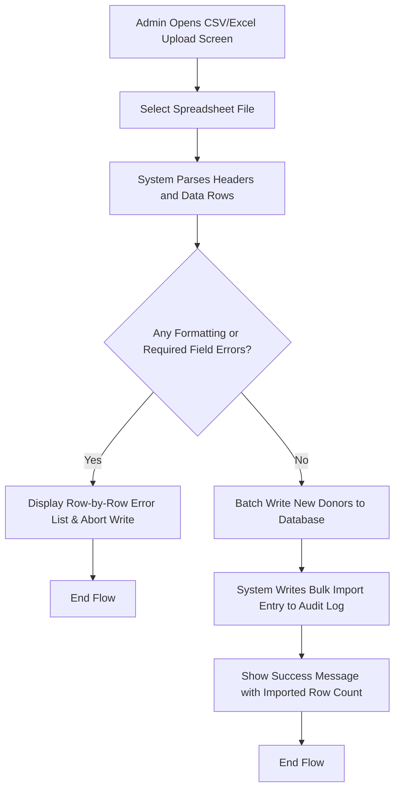

# Document Metadata: User Flows (user-flow.md)

*   **Purpose:** Maps visual and textual paths of core actions inside the web application for key workflows.
*   **Information Contained:** Mermaid diagrams, TanStack Query cache lifecycle states, client-side papaparse/xlsx verification hooks, and request status changes.
*   **Recommended Headings:** `# Document Metadata`, `# MVP User Flows`, `## 1. Donor Intake & Donation History Recording Flow`, `### Visual Flowchart`, `### Detailed Step Sequence`, `## 2. Blood Request Lifecycle Flow`, `## 3. Spreadsheet Donor Bulk Import Flow`.
*   **Dependencies:** [user-story.md](file:///d:/blood%20donetion%20softwere/docs/user-story.md) (diagrams the operations described by user stories).

---

# MVP User Flows

This document details the step-by-step user interactions and system transitions for key operations in the Internal Blood Management System.

---

## 1. Donor Intake & Donation History Recording Flow

This flow covers how the management team searches for or registers a donor, checks eligibility, and logs a new donation history record.

### Visual Flowchart

### Detailed Step Sequence

1.  **Look-up / Intake:** 
    *   Staff enters a name or phone number in the TanStack Table filter search.
    *   *If the donor is new*, the staff clicks "Register Donor", inputs contact details and blood group (validated by Zod), and submits.
    *   *If the donor is returning*, the staff clicks their row to open their profile.
2.  **Eligibility Verification:**
    *   The system checks the donor's eligibility status.
    *   If their last logged donation date was less than 56 days ago, their profile displays a "Deferred" status alert with the remaining days. The "Record Donation History" button is disabled.
3.  **Logging History:**
    *   If the donor is eligible, the staff clicks "Record Donation History".
    *   Staff enters: Patient Name, Hospital Name, Donation Date, and optional Notes.
4.  **Save & Status Sync:**
    *   Staff submits the form. The system updates the donor's `isEligible` flag to `false`, calculates the `deferredUntil` date (Donation Date + 56 days), appends the event to their timeline, and writes an entry to the `AuditLog` table.
    *   TanStack Query automatically invalidates the `donors` and `donorDetail` cache keys, refetching fresh details to display the updated "Deferred" status flag in the UI.

---

## 2. Blood Request Lifecycle Flow

This flow covers creating and managing blood requests submitted to the organization.

### Visual Flowchart

### Detailed Step Sequence

1.  **Creation:**
    *   Staff receives a request from a patient, contact person, or clinic.
    *   Staff opens the "Create Blood Request" form and fills in: Patient Name, Blood Group, Required Units, Required Date, Contact Person, Contact Number, Notes, and sets the Status to "Pending" (default).
    *   The system creates the database record and logs the action in the audit trail.
2.  **Monitoring:**
    *   The management team monitors the dashboard which highlights pending requests sorted by the required date.
3.  **Fulfillment or Cancellation:**
    *   Once contact is established and the units are secured or the request is no longer needed, staff selects the request and changes its status dropdown to "Fulfilled" or "Cancelled".
    *   The system saves the status update and logs the modification in the `AuditLog`.
    *   TanStack Query invalidates the `bloodRequests` query keys, updating dashboards and lists instantly.

---

## 3. Spreadsheet Donor Bulk Import Flow

This flow covers how the admin team uploads legacy spreadsheet data to register donors in bulk.

### Visual Flowchart

### Detailed Step Sequence

1.  **File Selection:**
    *   An admin navigates to the "Bulk Import" tab and selects a `.csv` or `.xlsx` file.
2.  **Parsing & Validation:**
    *   For CSV uploads, **papaparse** parses rows directly in the browser client. For Excel (`.xlsx`), the **xlsx** library processes sheets.
    *   Rows are validated against the Donor Zod schema. If errors are found, the upload is halted, and a list of invalid rows with descriptions is rendered (e.g. "Row 15: Invalid Blood Group 'X+'").
3.  **Database Batch Save:**
    *   If the file contains no errors, the parsed rows are sent in a POST body to `/api/donors/import`.
    *   The API route handler inserts the records inside a transaction, logs a single audit entry, and returns the imported count.
    *   TanStack Query invalidates the global `donors` cache query keys, displaying the imported donors in the Directory Grid.
