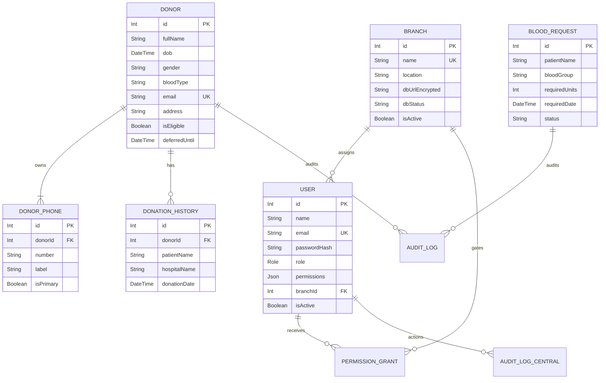
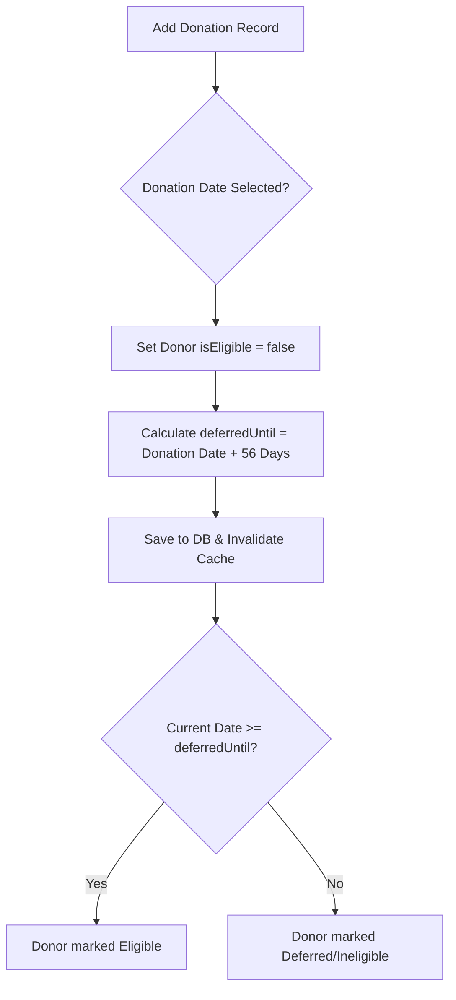

# System Specification & Software Guide: Quantum Blood Donor Pool

Welcome to the master documentation for the **Internal Blood Management System (Quantum Blood Donor Pool)**. This document provides a complete technical and functional overview of the web application, designed and optimized for laptop/desktop screen configurations.

---

## 1. System Vision & Purpose

The **Quantum Blood Donor Pool** is a secure, internal, desktop-first web application designed for organization management team members. In its updated architecture (**Update 1**), the software implements a **database-per-branch** layout. 

A single small centralized **Control Database** holds user accounts, branch metadata, and cross-branch visibility permissions. Each branch database runs on its own independent PostgreSQL instance to prevent shared storage/row limit exhaustion and ensure total database isolation.

The software ensures:
*   **Rapid Donor Matching:** Dynamic filtering by location, blood type, and eligibility status.
*   **Operational Integrity:** Strict adherence to medical donation guidelines (e.g., the 56-day wait period).
*   **Secure Administration:** Role-Based Access Control (RBAC) protecting sensitive personal health information (PII).
*   **Database Isolation:** A dynamic backend registry resolving tenant connections, preventing unauthorized cross-branch data access.
*   **Transparency:** An immutable central audit trail for admins and a local audit trail for branch managers.

---

## 2. Desktop/Laptop Interface Design & Mockup

The user interface is optimized for laptop screens ($1280 \times 800$ and above), utilizing a multi-pane layout to minimize page switching. 
*   **Permanent Sidebar Navigation:** Provides quick access to all modules without cluttering the screen space.
*   **Glassmorphic Container Cards:** Styled with deep slate tones and glowing crimson elements.
*   **Vibrant Charts & Data Visualizations:** Designed with Recharts to show active donor distribution and weekly donation trends.

### High-Fidelity Dashboard Mockup
Below is a high-fidelity visual preview of the dashboard screen when viewed on a modern laptop:


---

## 3. Technology Stack

The application is built using a modern, typesafe, and performant web development stack:

*   **Runtime Environment:** Node.js (v18+)
*   **Programming Language:** TypeScript (Strict Mode)
*   **Frontend & Routing Framework:** Next.js 15 (App Router, featuring Server Components & client-side React hydrated states)
*   **Styling Engine:** Tailwind CSS v4 (incorporating OKLCH fluid color definitions and standard light/dark modes)
*   **Database & ORM:** PostgreSQL database layered with Prisma ORM
*   **State Management:** Zustand (for lightweight global client states)
*   **Data Fetching & Cache:** TanStack Query (React Query)
*   **Data Grids:** TanStack Table (providing sorting, pagination, and client-side filtering)
*   **Form Management & Validation:** React Hook Form integrated with Zod validation schemas
*   **Spreadsheet Parsing:** xlsx (Excel spreadsheets) and papaparse (CSV files)
*   **Authentication & Security:** Auth.js (NextAuth v5)
*   **Connection Caching:** LRU client cache registry on the backend (capped at ~20 client instances)
*   **Test Suite:** Playwright (for End-to-End browser workflows) and Jest (for unit testing)

---

## 4. Relational Database Schema

The database architecture separates global administrative data from isolated tenant records:



### Table Specifications & Column Indexing
*   **Control Database:** Stores users, branch connections (URL strings encrypted via AES-256-GCM), context switch grants, and centralized admin logs.
*   **Branch Databases:** Replicated schemas housing donor profiles, multi-phone numbers (DonorPhone table with cascade deletes), histories, requests, and local audit trails.

---

## 5. Core Operational Mechanics & Rules

The system implements strict validation and business rules to automate donor tracking.

### 5.1 Donor Registration & Input Validation
When registering or updating a donor profile, the form inputs are validated using a custom Zod schema:
*   **Full Name:** Required, must contain a minimum of 2 characters.
*   **Date of Birth:** Must be a valid date representing an age of **18 years or older** at the time of signup.
*   **Gender:** Dropdown selector (e.g., Male, Female, Other).
*   **Blood Type:** Must match one of the eight standard blood groups: `A+`, `A-`, `B+`, `B-`, `AB+`, `AB-`, `O+`, `O-`.
*   **Phone Number:** Multiple numbers supported via `DonorPhone` table (number, label, primary boolean). Number lookups are indexed.
*   **Email:** Verified using strict regex format validations. Must be unique in the active branch database.

### 5.2 The 56-Day Wait Rule & Eligibility
To comply with health safety guidelines, a donor is restricted from giving blood more than once every 56 days (8 weeks):
1.  **Donation Trigger:** When a new `DonationHistory` entry is saved, the system automatically checks the `donationDate`.
2.  **State Sync:** The donor's `isEligible` column is flipped to `false`, and `deferredUntil` is calculated as:
    $$\text{deferredUntil} = \text{donationDate} + 56 \text{ days}$$
3.  **Automatic Clearance:** When the current date exceeds `deferredUntil` or if `deferredUntil` is null, the donor's status displays as "Eligible".
4.  **Manual Deferral Override:** Administrators can override this by inputting custom `deferralReason` text and specifying an alternate `deferredUntil` date.



### 5.3 Connection Routing & Decryption
For each client request, the system dynamically routes queries:
1.  **Context Resolution:** Resolves the session `branchId` (or Context switcher cookie override).
2.  **Decryption:** Decrypts connection URL from `Branch.dbUrlEncrypted` in the Control DB using AES-256-GCM.
3.  **Pool Fetch:** Pulls the Prisma client from the LRU cache (disposing the oldest if pool size > 20).
4.  **Query Execution:** Runs query against the resolved branch DB instance.

### 5.4 Bulk Spreadsheet Imports & Integrations
To support legacy spreadsheets, admins can batch-load donor tables:
*   **Parsing Flow:** Client-side parsing translates CSV contents (using **papaparse**) or XLSX files (using **xlsx**).
*   **Row-by-Row Checks:** Every data row is parsed against the Donor Zod schema *before* database submission.
*   **Error Reporting:** If validation fails on any row (e.g. invalid phone number format on Row 12), the bulk operation aborts, and a list of specific row errors is returned.
*   **Transaction Lock:** Successful uploads are dispatched in a single batch POST request and written using a database transaction against the resolved branch database.

---

## 6. Security & Roles Matrix

System privileges are managed using Role-Based Access Control (RBAC).

| Permission Key | Description | Volunteer Default | Admin Default | Super Admin Default |
| :--- | :--- | :---: | :---: | :---: |
| `donorView` | Browse donor list & view profile details | ✅ | ✅ | ✅ |
| `donorAdd` | Register new individual blood donors | ✅ | ✅ | ✅ |
| `donorEdit` | Modify donor contact info or details | ❌ | ✅ | ✅ |
| `donorDelete` | Mark a donor as deleted | ❌ | ✅ | ✅ |
| `approveReject` | Review & approve pending registrations | ❌ | ✅ | ✅ |
| `notesEdit` | Add internal staff notes on donor profiles | ❌ | ✅ | ✅ |
| `reportsExport` | Export donor metrics to PDF or Excel sheets | ❌ | ✅ | ✅ |
| `userManagement` | Create and manage user credentials / roles | ❌ | ✅ | ✅ |
| `branchCreate` | Create a branch and provision its database | ❌ | ❌ | ✅ |
| `branchCredentialView`| Reveal a branch's decrypted database URL | ❌ | ❌ | ✅ |
| `crossBranchGrant` | Grant users visibility into other branch databases | ❌ | ❌ | ✅ |

---

## 7. Developer Quickstart Setup

To run the application locally on a laptop/desktop, execute the following commands:

```bash
# 1. Install dependencies
npm install

# 2. Configure environment parameters
# Copy variables and specify CONTROL_DATABASE_URL and ENCRYPTION_KEY
cp .env.example .env

# 3. Run database migrations for the Control DB
npx prisma db push --schema=./prisma/control.schema

# 4. Boot local Next.js developer server
npm run dev
```

*   **Development Site URL:** [http://localhost:3000](http://localhost:3000)
*   **Testing Commands:**
    *   `npm test` (executes Jest tests)
    *   `npm run test:e2e` (executes Playwright E2E browser tests)
